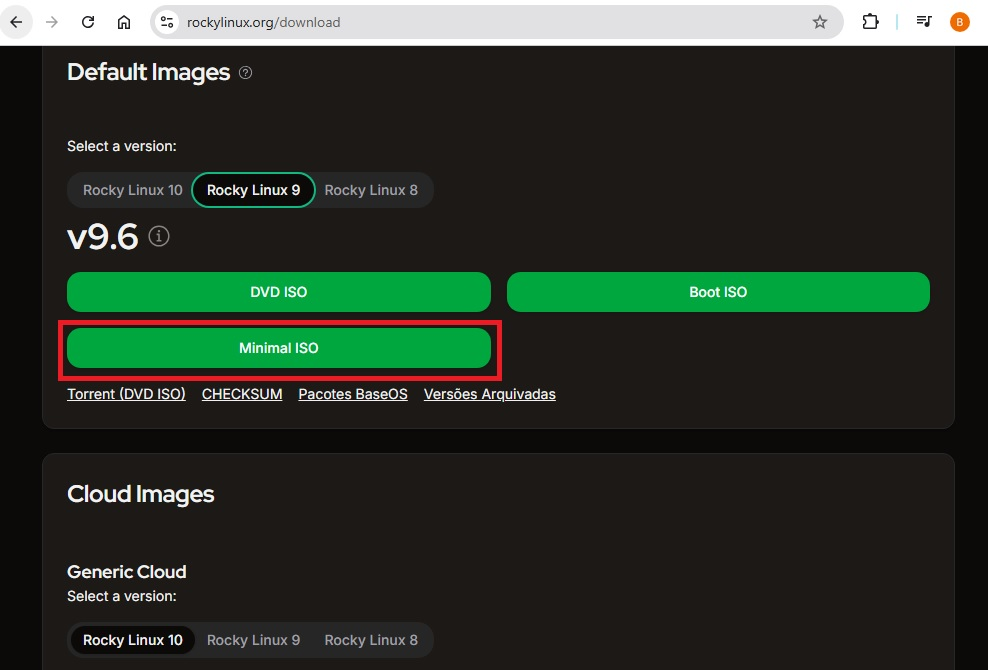
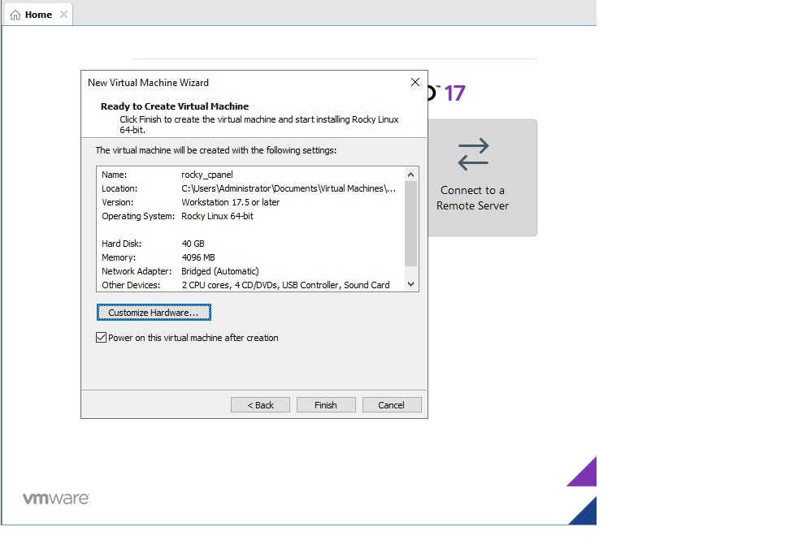
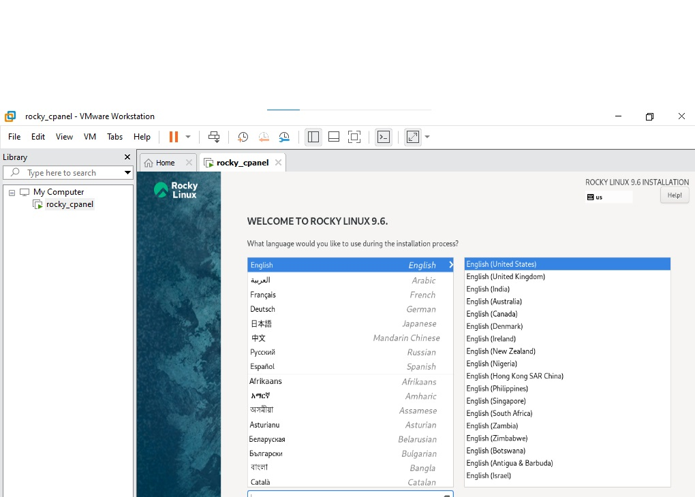
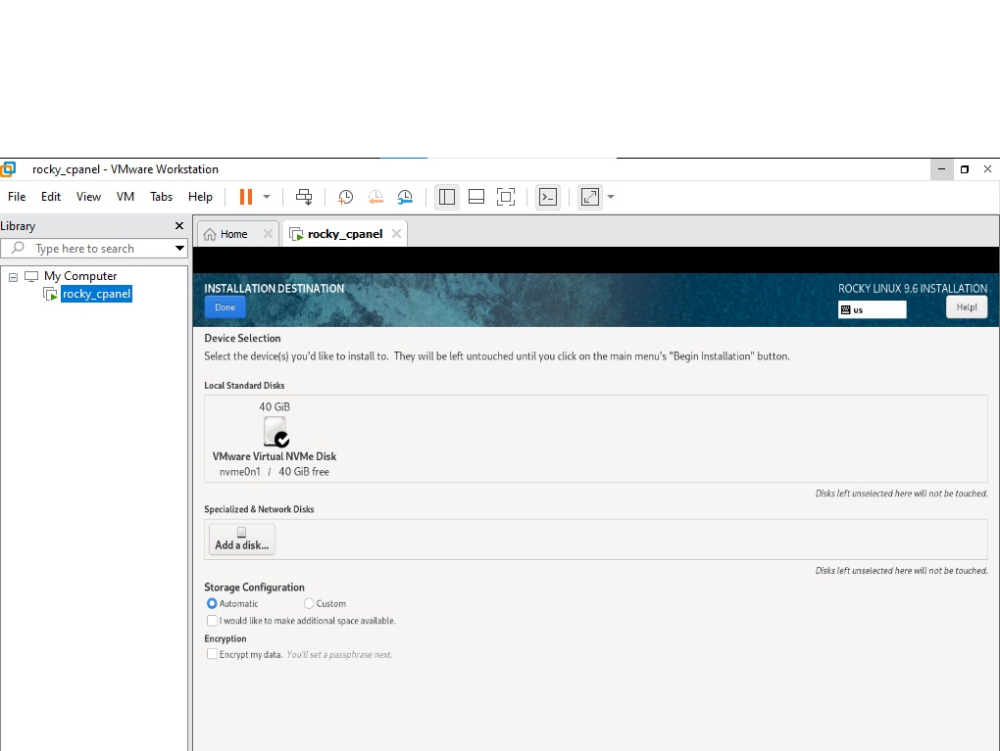

# Rocky Linux 9.6 Installation & Setup Documentation

## Project Overview
This document captures all steps taken to install and prepare Rocky Linux 9.6 on VMware for cPanel installation and future Active Directory integration.  
All commands, outputs, errors, and screenshots are documented for educational and portfolio purposes.

---

# Stage 0 — Installing Rocky Linux 9.6 on VMware

### Step 0.1 — Download ISO
**Action:**  
- Download the **Rocky Linux 9.6 DVD ISO** from the official website: [https://rockylinux.org/download/](https://rockylinux.org/download/)  

**Screenshot / Output:**  


**Notes / Errors:**  

---

### Step 0.2 — Create New VM in VMware
**Action:**  
1. Open VMware Workstation / Player  
2. Click **Create a New Virtual Machine** → Typical  
3. Select **Installer disc image (ISO)** → browse downloaded ISO  
4. OS type: Linux → Rocky Linux 9 x64 (or CentOS 9 if Rocky not listed)  
5. Name VM: `RockyVM`  
6. Allocate resources:  
   - CPU: 2 cores  
   - RAM: 4GB minimum  
   - Disk: 20GB minimum (preferably 40GB for cPanel)  

**Screenshot / Output:**  

**Notes / Errors:**  

---

### Step 0.3 — Install Rocky Linux

#### Step 0.3.1 — Language & Keyboard
- Select preferred **Language** and **Keyboard layout** → Click **Continue**  

**Screenshot / Output:**  

**Notes / Errors:**  

#### Step 0.3.2 — Installation Destination
- Select virtual disk  
- Automatic partitioning is fine  
- Click **Done**  

**Screenshot / Output:**  

**Notes / Errors:**  

#### Step 0.3.3 — Network & Hostname
- Enable network adapter (e.g., `ens160`) → Click **ON**  
- Set temporary hostname (we will update later)  
- Click **Done**  

**Screenshot / Output:**  

**Notes / Errors:**  

#### Step 0.3.4 — Root Password & User Creation
- Set secure root password  
- Optional: create a regular user  
- Click **Done**  

**Screenshot / Output:**  

**Notes / Errors:**  

#### Step 0.3.5 — Begin Installation
- Click **Begin Installation**  
- Wait for installation to complete  

**Screenshot / Output:**  

**Notes / Errors:**  

#### Step 0.3.6 — Reboot VM
- Reboot VM after installation  
- Remove ISO from virtual drive if prompted  

**Screenshot / Output:**  

**Notes / Errors:**  

---

### Step 0.4 — First Login
- Login as root or created user  
- If logged in as regular user:

```bash
su -


